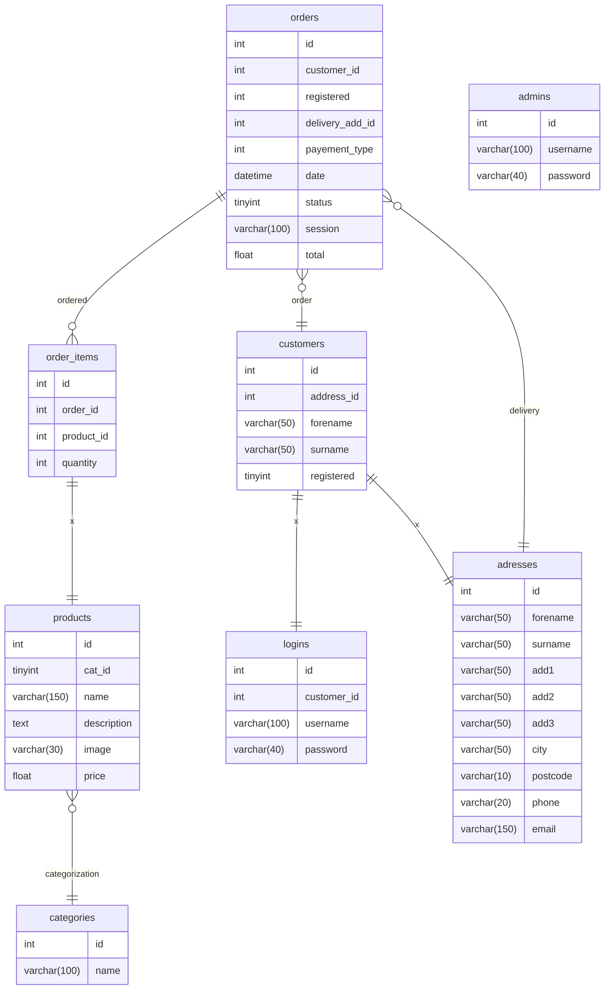

```mermaid
erDiagram
    orders {
        int id
        int customer_id
        int registered
        int delivery_add_id
        int payement_type
        datetime date
        tinyint status
        varchar(100) session
        float total
    }
    order_items {
        int id
        int order_id
        int product_id
        int quantity
    }
    products {
        int id
        tinyint cat_id
        varchar(150) name
        text description
        varchar(30) image
        float price
    }
    categories {
        int id
        varchar(100) name
    }
    customers {
        int id
        int address_id
        varchar(50) forename
        varchar(50) surname
        tinyint registered
    }
    logins {
        int id
        int customer_id
        varchar(100) username
        varchar(40) password
    }
    adresses {
        int id
        varchar(50) forename
        varchar(50) surname
        varchar(50) add1
        varchar(50) add2
        varchar(50) add3
        varchar(50) city
        varchar(10) postcode
        varchar(20) phone
        varchar(150) email
    }
    admins {
        int id
        varchar(100) username
        varchar(40) password
    }

    orders ||--o{ order_items: ordered
    order_items ||--|| products: x
    products }o--|| categories: categorization
    orders }o--|| customers: order
    customers ||--|| logins: x
    customers ||--|| adresses: x
    orders }o--|| adresses: delivery
```